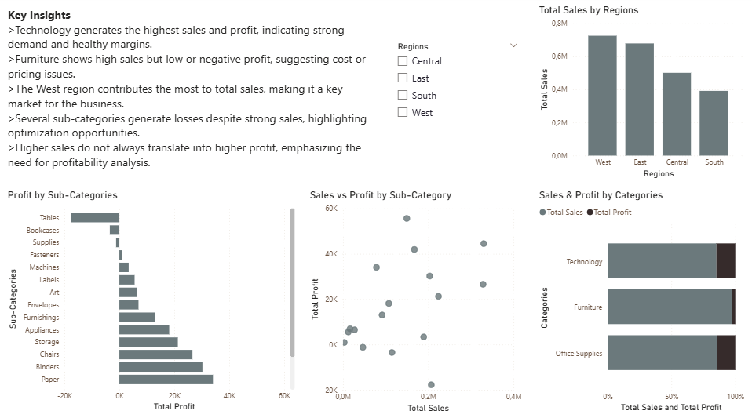

# 📊 Customer Sales & Profitability Analysis (Power BI)

## 🔍 Overview
This project presents an interactive Power BI dashboard analyzing customer sales and profitability.  
The goal is to identify high-performing regions, categories, and uncover loss-making segments to support data-driven decision-making.

---

## 💡 Key Insights
- 🖥️ Technology generates the highest sales and profit.
- 🛋️ Furniture shows high sales but low or negative profit.
- 🌍 The West region contributes the most to total sales.
- ⚠️ Several sub-categories generate losses despite strong sales.
- 📉 High sales do not always translate into high profit.

---

## 🧰 Tools Used
- Power BI
- Data Analysis
- Data Visualization
- Business Intelligence
- DAX

---

## 📸 Dashboard Preview

---

## 📁 Files Included
- `Project_2_Customer_Sales_Analysis.pbix` – Power BI dashboard file
- `customer_sales_analysis_dashboard.png` – Dashboard screenshot
